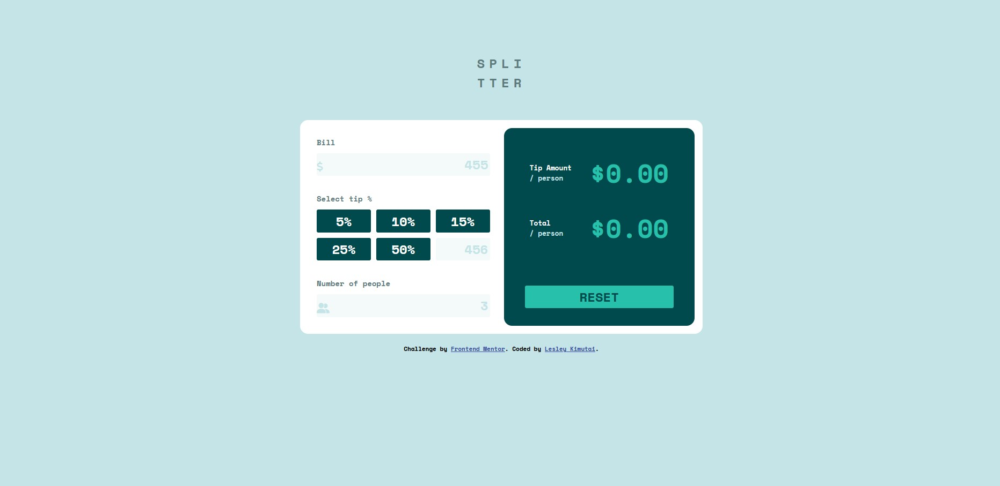
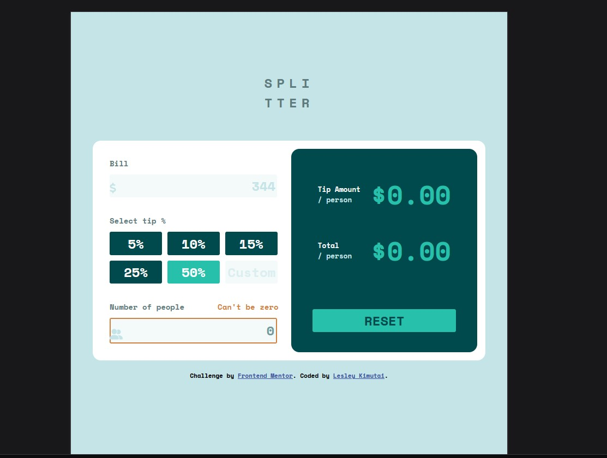

# Frontend Mentor - Tip calculator app solution

This is a solution to the [Tip calculator app challenge on Frontend Mentor](https://www.frontendmentor.io/challenges/tip-calculator-app-ugJNGbJUX). Frontend Mentor challenges help you improve your coding skills by building realistic projects.

## Table of contents

- [Overview](#overview)
  - [The challenge](#the-challenge)
  - [Screenshot](#screenshot)
  - [Links](#links)
- [My process](#my-process)
  - [Built with](#built-with)
  - [What I learned](#what-i-learned)
  - [Continued development](#continued-development)
- [Author](#author)
- [Acknowledgments](#acknowledgments)

**Note: Delete this note and update the table of contents based on what sections you keep.**

## Overview

### The challenge

Users should be able to:

- View the optimal layout for the app depending on their device's screen size
- See hover states for all interactive elements on the page
- Calculate the correct tip and total cost of the bill per person

### Screenshot

Laptop view of layout



Tablet mode of the calculator app



The mobile layout of the Tip calculator


### Links

- Solution URL: [Github Link](https://github.com/issagoodlifeInc/Tip-Calculator-App.git)
- Live Site URL: [Live Tip Calculator App](https://tip-calculator-leskim.netlify.app/)

## My process

Started out with the html markup
Then styled my components as per the requirements
Added responsivenes for mobile view
Finally added the js functionalities for the project

### Built with

- Semantic HTML5 markup
- CSS custom properties
- Flexbox
- CSS Grid
- Laptop-first workflow

### What I learned

Reinforced my DOM manipulation skills and used => functions for all my functions

Proud of these:-

```css
/* Add no people if value is 0 */
.nopeople {
  position: relative;
}

.nopeople input {
  border: 2px solid #d1803e;
  color: var(--vdkcyan);
}

.nopeople label[for="people"]::after {
  position: absolute;
  content: "Can't be zero";
  color: #d1803e;
  right: 14px;
}
```

```js
// Code to work with the custom tip input
customTipBtn.addEventListener("keydown", (e) => {
  if (e.key === "Enter" && e.target.value > 0) {
    calculateAll();
  }
  // Sellecting my inputs
  let container = document.querySelector(".container"),
    totalBill = container.querySelector('input[name="bill"]'),
    noOfPeople = container.querySelector('input[name="people"]'),
    customTip = container.querySelector('input[name="custom tip"]');

  // Making the background stick to the btns for 3s
  setTimeout(() => {
    btn.style.background = "hsl(183, 100%, 15%)";
  }, 3000);
  btn.style.background = "hsl(172, 67%, 45%)";
});
```

### Continued development

Making reusable and to the point code
Didn't like my function to calculcate the tip and total
Using tenarys for conditions not exceding 2

## Author

- Website - [Lesley Kimutai](https://leskimfamily.herokuapp.com/lesley)
- Frontend Mentor - [@Leskim](https://www.frontendmentor.io/profile/Leskim)
- Twitter - [@KimutaiLesley](https://twitter.com/KimutaiLesley)

## Acknowledgments

[Collins Kibenon](https://github.com/collinskibenon) You giving up on this made me want to do it more 😅 finish up your bro .... you got this 💪🏾
